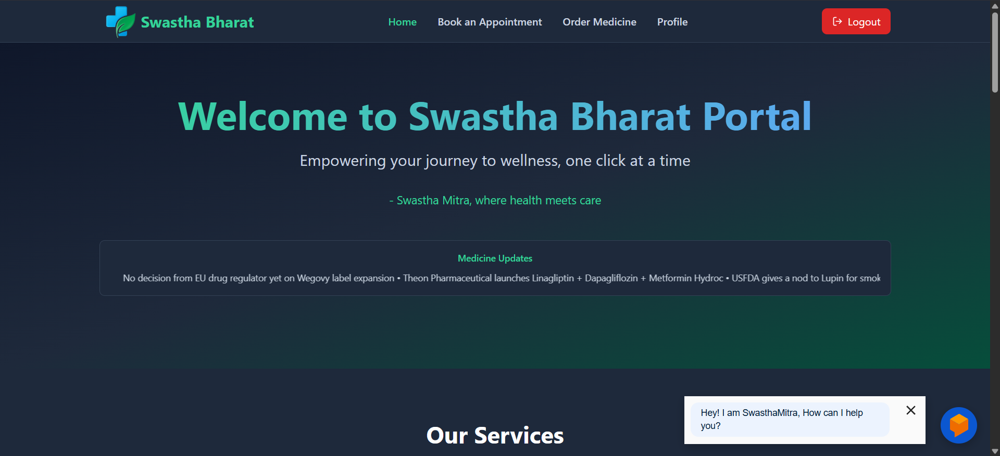
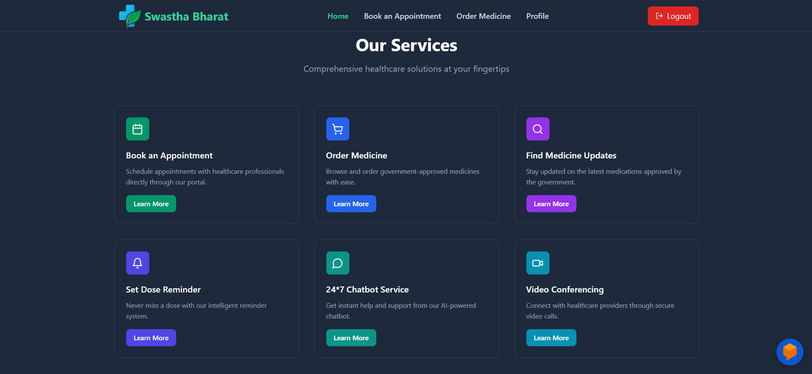
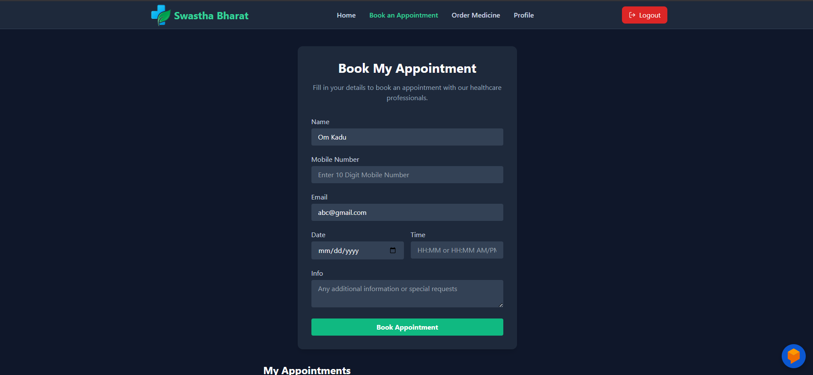
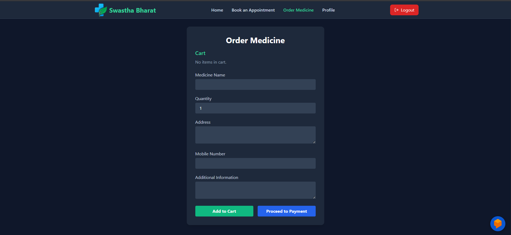
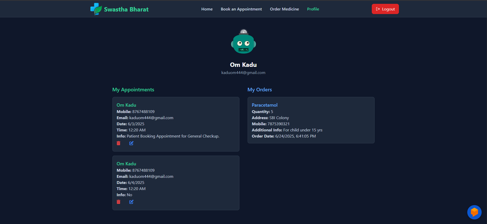

# Swastha Bharat Portal



---

## About

Swastha Bharat Portal is a modern, secure, and user-friendly full-stack web application for managing healthcare needs efficiently. Built with React, Vite, Node.js, Express, and MongoDB, it provides a seamless experience for users to register, book appointments, and order medicines online from any device.

---

## Features

- **User Registration & Login** with JWT-based authentication
- **Book Medical Appointments** with doctors
- **Order Medicines** online
- **Secure RESTful APIs** for all operations
- **Responsive UI** for all devices
- **Integrated Payments** (Razorpay)
- **Chatbot Support** (Dialogflow)
- **Toast Notifications** for instant feedback

---

## Tech Stack

- **Frontend:** React, Vite, Radix UI
- **Backend:** Node.js, Express
- **Database:** MongoDB
- **Authentication:** JWT
- **Payments:** Razorpay
- **Chatbot:** Dialogflow
- **Deployment:** Render

---

## Screenshots







---

## Getting Started

### Prerequisites

- Node.js (v18+ recommended)
- npm

### Installation

1. **Clone the repository:**
    ```sh
    git clone https://github.com/yourusername/swastha-bharat-portal.git
    cd swastha-bharat-portal
    ```

2. **Install frontend dependencies and build:**
    ```sh
    npm install
    npm run build
    ```

3. **Install backend dependencies:**
    ```sh
    cd Backend
    npm install
    ```

4. **Set up environment variables:**  
   Create a `.env` file in the `Backend` folder:
    ```
    MONGO_URL=your_mongodb_connection_string
    JWT_SECRET=your_jwt_secret
    ```

5. **Start the backend server:**
    ```sh
    node index.js
    ```

6. **Visit the app:**  
   Open [http://localhost:5000](http://localhost:5000) in your browser.

---

## Deployment

The app is deployed on [Render](https://render.com/).

**Render Build Command:**
```sh
npm install
npm run build
cd Backend && npm install
```

**Render Start Command:**
```sh
cd Backend && node index.js
```

---

## API Endpoints

- `POST /api/auth/createuser` – Register a new user
- `POST /api/auth/login` – Login user
- `POST /api/book/appointment` – Book an appointment
- `POST /api/order/medicine` – Order medicine

---


## Acknowledgements

- [React](https://react.dev/)
- [Vite](https://vitejs.dev/)
- [Express](https://expressjs.com/)
- [MongoDB](https://www.mongodb.com/)
- [Render](https://render.com/)
- [Razorpay](https://razorpay.com/)
- [Dialogflow](https://dialogflow.cloud.google.com/)

---

*Feel free to add more sections or customize